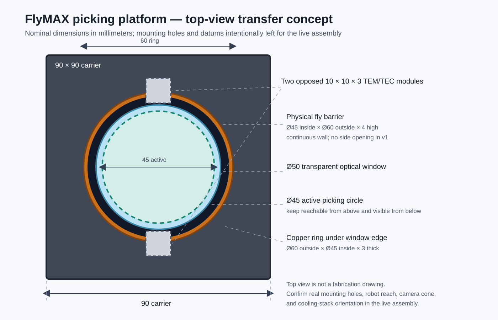
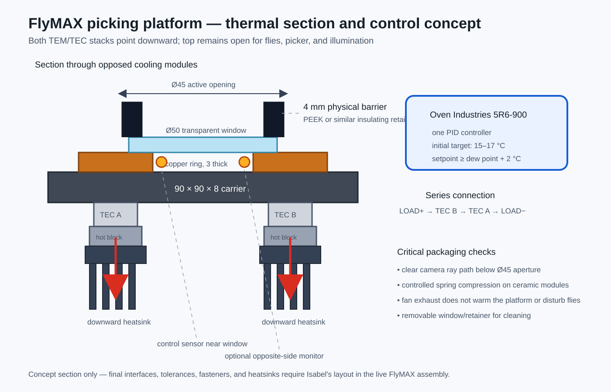

# Picking-platform concept transfer for Isabel

**Status:** lightweight mechanical handoff for rapid iteration; not release CAD

**Owner for the next design pass:** Isabel Lehenbauer

**Purpose:** preserve the few decisions that define the picking platform while leaving ordinary packaging details open for fast mechanical iteration.

This bundle describes the **custom FlyMAX picking platform currently under development**. It is separate from the survey of commercial robot and gantry options in [`../FlyMAX_commercial_robotics_options_2026-08-08.md`](../FlyMAX_commercial_robotics_options_2026-08-08.md).

## Concept in one paragraph

Build an open-top transparent platform with a **45 mm active picking circle** on a **50 mm optical window**. A low physical wall around the active circle prevents flies from walking out sideways while leaving the top open to the picker. A copper annulus under the edge of the window spreads heat to **two opposed 10 × 10 mm thermoelectric modules (TEMs/TECs)**. One on-hand **Oven Industries 5R6-900** controller drives the two identical modules in series from a temperature sensor in the copper ring. The hot sides, hot blocks, and heatsinks point downward so the top remains clear for the robot, lighting, and loading.

## Dimensions to carry into the first layout

| Feature | Nominal concept dimension | What matters |
|---|---:|---|
| Active picking area | **Ø45 mm** | Keep the whole area reachable from above and visible from below. |
| Transparent window | **Ø50 mm** | Swappable optical element; preserve an unobstructed Ø45 mm clear aperture. |
| Physical fly barrier | **Ø45 mm inside, Ø60 mm outside, 4 mm high** | Continuous low wall; no open side notch in the first version. A 1 mm inward lip is optional. |
| Copper cold ring | **Ø60 mm outside, Ø45 mm inside, 3 mm thick** | Contact the outer window annulus and both cold-side bosses. |
| Carrier plate | **90 × 90 × 8 mm** | Concept envelope only; final mounting-hole and datum locations come from the live assembly. |
| Thermoelectric modules | **2 × 10 × 10 × 3 mm** | Place diametrically opposite one another under the copper ring. |
| Local cold-side bosses | **approximately 12 × 13 mm** | Short path from each module to the copper annulus. |
| Window baseline | **50 mm diameter × 3.3 mm Borofloat** | Keep the clamp adaptable to a thinner window by changing a spacer, not the whole carrier. |

All dimensions are nominal and should be checked against the robot reach, lower-camera ray path, and available heatsink space before fabrication.

## Essential construction details

1. **Contain the flies mechanically.** Use a removable black PEEK or similarly insulating retainer ring as the physical perimeter wall. The wall is the primary barrier; a Fluon coating on only the vertical wall/lip can be tested as a secondary measure. Do not coat the optical working surface.
2. **Keep the top clear.** Nothing except the low barrier should project above or outward into the picker and illumination space.
3. **Clamp the window gently.** Use three evenly spaced shoulder screws with wave or Belleville springs. Do not rigidly torque a flat ring onto glass.
4. **Put both TEM/TEC stacks below the ring.** Each stack is copper ring/boss → thin thermal interface → TEM/TEC → hot block → heatsink. Provide a hard stop or controlled spring compression so the ceramic modules remain parallel and are not crushed.
5. **Preserve the optical opening.** The camera below must see the complete Ø45 mm active circle without clipping by the carrier, copper ring, modules, wiring, or heatsinks.

## Temperature control

Use one Oven Industries 5R6-900 controller and one control sensor embedded in the copper ring close to the window. Wire the identical modules in series:

`5R6 LOAD+ → TEM/TEC A → TEM/TEC B → 5R6 LOAD−`

The initial operating target is **15–17 °C**, subject to condensation control. Start with the controller output limited to **17.6 V or lower** for the series pair and tune at low power. Before final assembly, verify at low output that both cold faces cool together.

A second sensor on the opposite side of the copper ring is useful for detecting a poor thermal joint or side-to-side gradient. Do not command a setpoint below **ambient dew point + 2 °C**.

## What Isabel needs to decide in the first pass

Only these interfaces need to be resolved before a simple model can become a fabrication drawing:

- exact carrier mounting-hole and datum locations from the live FlyMAX assembly;
- orientation of the opposed TEM/TEC stacks relative to the lower camera and illumination;
- available downward envelope for hot blocks, heatsinks, fans, and cable exits;
- retainer attachment and cleaning/removal access;
- whether the 4 mm wall and optional inward lip adequately contain the flies without obstructing picking near the edge.

The detailed camera mount, fold mirror, vendor-complete BOM, and polished full-system CAD are intentionally outside this transfer bundle.

## Fast iteration sequence

1. Place the 90 mm carrier envelope and Ø45 mm active circle in the current FlyMAX assembly.
2. Add the Ø50 mm window, Ø60 mm retainer/copper rings, and two opposed module envelopes.
3. Check robot access from above and the full camera cone from below.
4. Choose the real mounting holes, datums, and downward cooling-stack orientation.
5. Print or machine an inexpensive retainer/carrier mockup and test fly containment before committing to the copper part.
6. Build one thermal prototype and map copper-ring and window-center temperature before refining the heatsinks.

## Minimum acceptance checks

- **Containment:** flies cannot leave sideways during a representative open-top trial; record any escapes or persistent wall clustering.
- **Reach:** the picker can approach the entire Ø45 mm active area without contacting the wall.
- **Optics:** the complete active circle is visible from below with no hardware clipping.
- **Thermal:** both modules operate together; the platform reaches the chosen condensation-safe setpoint; record center, edge, and both ring-side temperatures.
- **Service:** the window and retainer can be removed for cleaning without disturbing the permanent carrier alignment.

## Bundle contents

- [`README.md`](README.md) — this transfer plan
- [`picking_platform_top_view.svg`](picking_platform_top_view.svg) — top-view concept and primary dimensions
- [`picking_platform_thermal_section.svg`](picking_platform_thermal_section.svg) — section, heat path, and controller wiring
