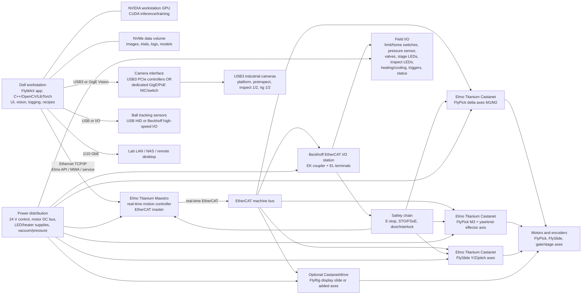

# FlyMAX Rebuild: Hardware Interconnect Architecture and Dell PC Spec

## Architecture Assumption

The original FlyMAX thesis used a Windows/C++ FlyMAX application that talked directly to a mix of USB cameras, vendor motor controllers, microcontrollers, pneumatic controllers, LED controllers, temperature controllers, and display microcontrollers. For the rebuild, the cleaner architecture is:

- PC handles UI, experiment orchestration, machine vision, neural-network inference, logging, recipe management, and data storage.
- Elmo Titanium Maestro handles deterministic multi-axis motion and the EtherCAT motion bus.
- Elmo Titanium Castanet drives handle the servo axes.
- Beckhoff EtherCAT I/O handles sensor and actuator wiring, including discrete I/O, analog sensing, trigger/strobe lines, valve control, lighting enables, limit/home switches, and safety/status interlocks.
- Cameras connect either as USB3 devices or as GigE Vision devices. If using GigE cameras, give them a dedicated camera NIC or camera switch/network that is isolated from lab Ethernet and from the EtherCAT/motion network.

## Hardware Interconnect Diagram

## Dell Workstation Recommendation

Recommended order target: Dell Precision 5860 Tower.

Suggested configuration:

- CPU: Intel Xeon W5-2545 or W5-2565X class. The motion controller owns hard real-time work, so prioritize stable workstation thermals and enough cores for camera acquisition, image processing, UI, and logging.
- OS: Windows 11 Pro for Workstations.
- Memory: 128 GB DDR5 ECC RDIMM. 64 GB works for commissioning, but 128 GB is the better floor for multi-camera imaging, model training/test runs, and long experiment sessions.
- GPU: NVIDIA RTX PRO 4000 Blackwell 24 GB ECC if available in your Dell configurator; otherwise NVIDIA RTX 4000 Ada 20 GB. Use RTX PRO 5000/6000 only if you expect heavy model training on the machine.
- Storage: 2 TB NVMe boot/app/model drive plus 4 TB NVMe scratch/data drive. Add an 8-12 TB SATA HDD or NAS target for raw trial archive.
- Network: use the onboard 1 GbE for lab/admin and 10 GbE for NAS or a private device network. Add a dedicated Intel PCIe NIC if the PC will run TwinCAT/EtherCAT directly or if you want the Elmo/service network isolated.
- USB: add PCIe USB3 host-controller cards if running more than two high-bandwidth USB3 cameras concurrently. Avoid putting all thesis-style cameras behind one hub.
- Power/chassis: choose the higher-wattage chassis option available for the GPU and add-in cards, plus ProSupport/onsite service.

Value alternative: Dell Pro Max Tower T2. It is orderable and expandable, and Dell lists Core Ultra 9, 1500 W PSU options, extra NIC options, and PCIe add-ins. I would choose it only if budget is tighter and you can live with fewer PCIe lanes/less workstation memory headroom than the Precision 5860.

## Dell System Comparison

Pricing and availability were checked against Dell US pages on 2026-05-07. Treat these as budgeting anchors, not formal quotes, because Dell pricing, discounts, availability, and configuration rules change by link, account, and cart state.

| Category | Precision 5860 Tower | Precision 7960 Tower | Dell Pro Max with GB10 |
| --- | --- | --- | --- |
| Best role in this FlyMAX rebuild | Recommended control workstation for machine vision, UI, logging, GigE camera network, and Elmo/Beckhoff integration. | Larger version of the same idea; useful if you expect many PCIe cards, multiple large GPUs, or very large local storage. | AI appliance / local model-development node, not a primary machine-control PC. |
| Dell site price observed | Listed configuration: $7,050.37; build-your-own shown from $5,444.85. A configured FlyMAX machine with W5 CPU, 128 GB ECC, RTX 4000 Ada/Blackwell-class GPU, and NVMe storage should be quoted, but expect materially above the listed base. | Listed configuration: $9,885.66; AI workstation config: $15,463.89; build-your-own shown from $9,281.77. | Listed 4 TB configuration: $6,332.18. Storage can be reduced to 2 TB or 1 TB for lower price on the Dell configurator. |
| CPU | Intel Xeon W3/W5/W7-2400 or W-2500 family; recommended W5-2545 or W5-2565X class. | Intel Xeon W5/W7/W9-3400/3500 family; Dell lists up to 56-core Xeon on the product page and 60-core W9-3595X in the configurator. | NVIDIA GB10 Grace CPU, 20 ARM cores: 10 Cortex-X925 + 10 Cortex-A725. |
| OS | Windows 11 Pro for Workstations recommended; Linux options available. | Windows 11 Pro for Workstations recommended for control stack; Linux options available. | NVIDIA DGX OS 7. This is a big compatibility issue for Windows-first motion/camera vendor SDKs. |
| GPU | Workstation GPU options include RTX 4000 Ada, RTX 4500/5000/6000 Ada, and RTX PRO Blackwell options depending on current configurator path. Recommended: RTX 4000 Ada or RTX PRO 4000/4500-class card. | Larger GPU envelope; Dell page/configurator lists RTX 2000 Ada through RTX 6000 Ada and dual GPU options. | Integrated NVIDIA GB10 Blackwell GPU; strong for local AI development, but not a removable workstation GPU. |
| Memory | DDR5 ECC RDIMM. Dell markets up to 2 TB. Recommended: 128 GB ECC. | DDR5 ECC RDIMM. Dell lists 16 DIMM slots and very large capacities; current page shows options up to 1 TB available and higher capacities marked unavailable in that config. | Fixed 128 GB LPDDR5X unified memory. No practical memory expansion. |
| Storage | Dell markets up to 56 TB; current page shows 2 internal M.2 NVMe slots, 2 SATA slots, and 2 external storage flexbays. Recommended: 2 TB NVMe boot + 4 TB NVMe data + NAS/archive. | Much stronger storage expansion: up to 8 M.2 NVMe drives via front/rear flexbays, plus 8-10 externally facing storage flexbays depending on optical-drive configuration. | 1 TB, 2 TB, or 4 TB M.2 Gen4 options. No tower-style storage bays. |
| Network for GigE cameras | Good. Has 1 GbE + 10 GbE onboard; add Intel PCIe NIC or PoE switch/NIC for camera subnet. | Excellent. Has 1 GbE + 10 GbE onboard and enough PCIe slots for multi-port 10/25GbE camera NICs. | Has 10GbE RJ45 and two 200 Gbps QSFP ports, but no PCIe expansion and DGX OS makes machine-control integration less straightforward. |
| External ports | Front: USB-A/USB-C/audio/SD. Rear: multiple USB-C/USB-A, 1GbE, 10GbE, line-out, optional serial/PS2. | Similar workstation I/O: front USB-A/USB-C/audio/SD; rear USB-C/USB-A, 1GbE, 10GbE, line-out, serial, PS2. | Three USB-C 20 Gbps ports with DP alt mode, HDMI 2.1, 10GbE RJ45, two 200G QSFP, USB-C power input. |
| PCIe expandability | Strong: 1 full-height Gen5 x16, 1 full-height Gen4 x16, 2 full-height Gen4 x8, 1 full-height Gen4 x4. Good for GPU + GigE NIC + optional frame grabber/USB/DAQ cards. | Best: 2 full-height Gen5 x16, 2 full-height Gen4 x16, 2 full-height Gen4 x8, 2 half-height half-length Gen4 x8 wired x4. | None. Dell lists no slots. |
| Power/chassis | 750 W listed; 1350 W optional. Mid-tower, easier to place near the rig. | 1400 W or 2200 W-class chassis options. Large and heavy tower. | 280 W USB-C external adapter. Very compact. |
| Machine-control fit | Best balance. Windows workstation, ECC memory, enough PCIe and network expansion, reasonable size/cost. | Technically excellent, but likely overkill unless you need major GPU/storage/PCIe growth. | Poor as primary control PC: ARM/DGX OS, no PCIe slots, no Windows workstation stack, fixed memory/storage. Useful as a separate AI box if desired. |
| Recommendation | Buy this unless the final camera count, storage plan, or GPU plan exceeds its PCIe/storage envelope. | Consider only if the system will grow into many cameras/NICs, multiple GPUs, local model training, or large onboard storage. | Do not use as the FlyMAX operations PC. Consider separately for AI model prototyping/inference experiments. |

Bottom line: GigE cameras make NIC planning more important, but they do not push the system toward the GB10. They slightly strengthen the case for the Precision 5860 or 7960 because both can accept dedicated Intel camera NICs and still leave room for GPU/storage expansion. The GB10 is impressive, but it is the wrong shape for an expandable instrumentation-control workstation.

## Integration Notes

- Put motors, hard limits, home switches, and safety on the Elmo/Beckhoff real-time side, not in USB software callbacks.
- Keep cameras PC-attached. For GigE Vision, prefer a dedicated camera subnet with static IPs, jumbo frames if supported end-to-end, vendor-recommended packet delay settings, and a network budget sized for the aggregate camera bandwidth. Use hardware triggers from Beckhoff I/O where repeatable timing matters.
- Treat the PC as a supervisory workstation. The thesis-style FlyMAX app can still remain C++17/OpenCV/LibTorch, but the low-level motor and I/O libraries should become Elmo/Beckhoff abstraction layers.
- Keep the EtherCAT machine network physically isolated from lab Ethernet.
- Plan cabinet power separately from the PC: 24 V controls, motor bus supply sized for the Castanets, LED drivers, heaters, vacuum/pressure hardware, and safety relays/TwinSAFE as appropriate.

## Source Links

- Dell Precision 5860 Tower product/configuration page: https://www.dell.com/en-us/shop/desktop-computers/precision-5860-tower-workstation/spd/precision-5860-workstation
- Dell Precision 7960 Tower product/configuration page: https://www.dell.com/en-us/shop/desktop-computers/precision-7960-tower-workstation/spd/precision-t7960-workstation
- Dell Pro Max with GB10 product/configuration page: https://www.dell.com/en-us/shop/desktop-computers/dell-pro-max-with-gb10/spd/dell-pro-max-fcm1253-micro
- Dell Pro Max with GB10 owner manual, external ports and slots: https://www.dell.com/support/manuals/en-us/dell-pro-max-fcm1253-micro/dell_pro_max_with_gb10_fcm1253_om/external-ports-and-slots
